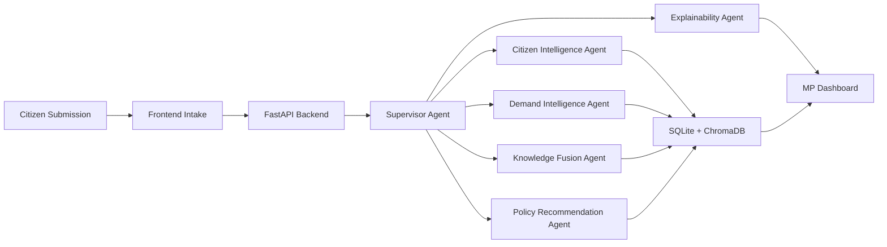
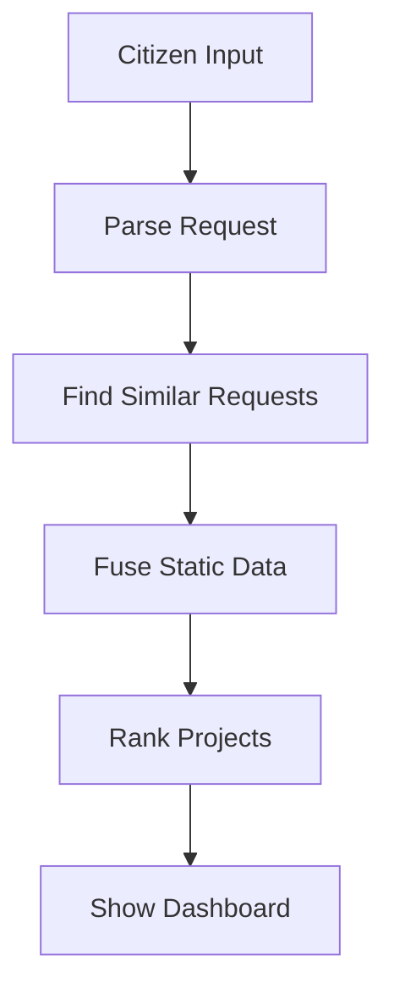
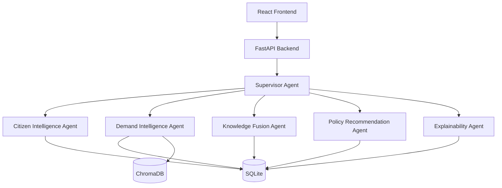
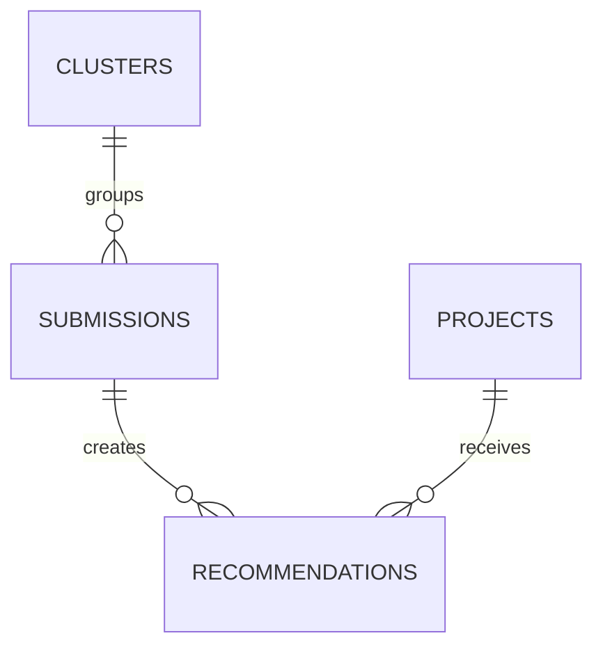
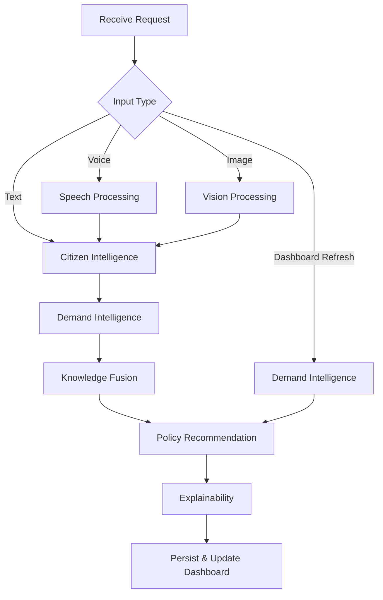

# MeriAwaaz AI
## Project Specification v1.0

Status: Draft for implementation approval
Version: 1.0
Date: 2026-07-01

## 0. Hackathon Scope Optimization

This version is intentionally simplified for a 5-day, 4-student hackathon build. The goal is not to build a production-grade government platform. The goal is to deliver a polished, believable demo that judges can understand in under 5 minutes.

### Simplification Rules Applied
- If a feature is invisible to judges, it is moved to Future Work.
- If a feature adds implementation risk without improving the core demo, it is simplified or removed.
- The core demo path is: citizen submits a request -> AI understands it -> AI finds similar requests -> AI combines a small public dataset -> AI ranks projects -> MP dashboard shows results and evidence.

### Section Decisions
| Section | Decision | Reason |
|---|---|---|
| Product Vision | KEEP | Still the core story. |
| Functional Requirements | SIMPLIFY | Focus on text-first flow with optional voice/image. |
| Non-Functional Requirements | SIMPLIFY | Prioritize demo reliability over enterprise robustness. |
| User Stories | KEEP | The core user value remains the same. |
| System Architecture | SIMPLIFY | Keep five agents, but reduce complexity. |
| Folder Structure | SIMPLIFY | Keep only the folders needed for rapid implementation. |
| Database Schema | SIMPLIFY | Reduce to 4–5 practical tables. |
| Chroma Schema | SIMPLIFY | Use one lightweight collection. |
| LangGraph State | SIMPLIFY | Keep only the minimum needed for the demo. |
| Agent Specs | SIMPLIFY | Each agent should return 3–5 fields only. |
| API Contracts | SIMPLIFY | Only 3 demo endpoints are required. |
| Prompt Specs | SIMPLIFY | One prompt file per agent is enough. |
| Dataset Preparation | SIMPLIFY | Use one synthetic dataset plus a few static JSON files. |
| Development Order | KEEP | The order is still valid, but it is shorter. |
| Team Responsibilities | SIMPLIFY | Each member owns one clear slice. |
| Testing Plan | SIMPLIFY | Focus on the happy path and one failure path. |
| Stretch Goals | MOVE TO FUTURE WORK | Keep them out of the main build. |

---

## 1. Product Vision

MeriAwaaz AI is a multilingual AI decision support system that converts anonymous citizen voice submissions into ranked constituency development recommendations. The platform ingests text, voice, and image inputs, understands their intent, clusters recurring demands, fuses them with public datasets, and produces explainable development priorities for MPs and constituency planners.

### Vision Statement
Turn citizen voices into evidence-based development priorities through a beautiful, explainable, multilingual AI workflow.

### Product Principles
- Prototype-first for hackathon impact.
- Explainability over black-box reasoning.
- Deterministic ranking over LLM-driven score changes.
- Beautiful demo experience over production-scale engineering.
- Agent orchestration over monolithic processing.

### Success Criteria
- A citizen can submit a request in text, voice, or image and receive a structured understanding of it.
- The dashboard updates immediately with grouped demand themes, hotspots, and ranked recommendations.
- Each recommendation includes evidence cards and a human-readable reason.
- The system can be demonstrated end-to-end within a 5–7 minute live session.

### Mermaid: High-Level Product Flow


---

## 2. Functional Requirements

### FR1. Core Demo Flow
The system must support the following end-to-end demo path:
1. Citizen submits a request in text.
2. The system extracts the issue category, and location.
3. The system finds similar requests.
4. The system combines a small static knowledge base.
5. The system ranks a small list of development projects.
6. The dashboard shows the ranked list, a heatmap, and evidence.

### FR2. Multimodal Input
The system should support:
- text input as the primary path
- voice input as an optional enhancement
- image input as an optional enhancement

If time is tight, implementation should prioritize text first.

### FR3. Simple Conversation
The citizen experience should ask at most one follow-up question before submission. The goal is to make the flow feel conversational but not complex.

### FR4. Structured Understanding
The system must output a compact JSON object containing:
- issue category
- location
- summary
- confidence

### FR5. Demand Intelligence
The system must detect recurring issues by comparing new submissions with existing ones and grouping them into a small number of clusters.

### FR6. Lightweight Knowledge Fusion
The system must combine a small static knowledge base with:
- population information
- basic infrastructure indicators
- a small list of demo proposals

### FR7. Deterministic Recommendation
The system must rank projects using a fixed weighted formula. The LLM may explain the result, but it must not change the score.

### FR8. Explainability
Each recommendation must show:
- a short reason
- 2–3 evidence bullets
- a confidence score

### FR9. Dashboard
The dashboard must show:
- a simple heatmap
- a ranked list of projects
- one selected recommendation with evidence

### FR10. No Authentication
The system is anonymous and requires no login.

### Mermaid: Simplified Functional Flow


---

## 3. Non-Functional Requirements

### NFR1. Speed
The full flow should complete in under 20 seconds for the demo path.

### NFR2. Demo Reliability
The system should work consistently for a fixed demo dataset and a small number of test inputs.

### NFR3. Clear Explainability
Every recommendation should be understandable in plain language.

### NFR4. Low Implementation Risk
The architecture should avoid unnecessary complexity, background jobs, and multi-step orchestration.

### NFR5. Simplicity
The codebase should stay small enough for four students to complete in five days.

### NFR6. Privacy
No authentication is required, and no sensitive personal data should be stored.

---

## 4. User Stories

### Citizen User Stories
1. As a citizen, I want to submit a development need in my own language so that my concern can be understood.
2. As a citizen, I want to describe a problem using voice or image so that I do not need to type.
3. As a citizen, I want the system to ask me clarifying questions so that my request is captured accurately.
4. As a citizen, I want to see that my input contributes to a larger constituency-level plan so that my voice matters.

### MP / Planner User Stories
1. As an MP, I want to see recurring issues clustered by geography so that I can understand local priorities.
2. As an MP, I want to see ranked development projects with evidence so that I can evaluate them quickly.
3. As an MP, I want to adjust the weights of criteria so that I can explore alternative planning scenarios.
4. As an MP, I want to understand why a project was recommended so that I can defend the decision.

### Engineering Team User Stories
1. As an engineer, I want clear API contracts so that I can implement my module independently.
2. As an engineer, I want structured logs so that I can debug agent behavior.
3. As an engineer, I want shared schemas so that I can integrate my module into the pipeline safely.

---

## 5. System Architecture

### Architectural Goals
- Keep the system simple enough for a 5-day build.
- Preserve the five-agent structure because it is a strong hackathon differentiator.
- Use deterministic scoring for the ranking.
- Use a single backend entrypoint and one shared state object.

### High-Level Architecture


### Runtime Flow
1. The frontend sends a submission to FastAPI.
2. FastAPI starts the LangGraph workflow.
3. The supervisor routes to the right agent chain.
4. The result is written to SQLite and optionally to ChromaDB.
5. The dashboard refreshes with the latest ranking and evidence.

### Component Boundaries
- Frontend: chat UI and dashboard.
- Backend: API, workflow orchestration, scoring, persistence.
- Agents: lightweight processing with minimal JSON output.
- Storage: SQLite for structured records and ChromaDB for simple similarity retrieval.

---

## 6. Folder Structure

```text
MeriAwaaz-AI/
├── frontend/
│   ├── src/
│   │   ├── components/
│   │   ├── pages/
│   │   ├── services/
│   │   └── styles/
│   └── package.json
├── backend/
│   ├── app/
│   │   ├── api/
│   │   ├── agents/
│   │   ├── schemas/
│   │   └── services/
│   └── requirements.txt
├── datasets/
│   └── demo/
├── docs/
├── prompts/
├── scripts/
├── tests/
├── assets/
└── README.md
```

---

## 7. Repository Structure

### Ownership
- Frontend member: chat UI and dashboard.
- Backend member 1: API and workflow integration.
- Backend member 2: data loading and scoring.
- Team lead: agent prompts and final demo flow.

### Simplification Rule
All shared contracts should be agreed before implementation starts, but the implementation should stay intentionally small.

---

## 8. Database Schema

The database is intentionally small. The goal is to store only what is needed to support the demo and the dashboard.

### Tables

#### submissions
```text
id: TEXT PRIMARY KEY
created_at: TEXT
source: TEXT
text: TEXT
location_hint: TEXT
issue_category: TEXT
urgency: TEXT
summary: TEXT
confidence: REAL
cluster_id: TEXT
```

#### clusters
```text
id: TEXT PRIMARY KEY
name: TEXT
size: INTEGER
hotspot: TEXT
```

#### projects
```text
id: TEXT PRIMARY KEY
title: TEXT
category: TEXT
location: TEXT
estimated_cost: REAL
```

#### recommendations
```text
id: TEXT PRIMARY KEY
submission_id: TEXT
project_id: TEXT
priority_score: REAL
confidence: REAL
created_at: TEXT
```

`reason` and `evidence` are generated on demand by the Explainability Agent and are NOT stored in SQLite. This keeps dashboard refresh fast and API-call-free.

#### agent_logs
```text
id: TEXT PRIMARY KEY
agent_name: TEXT
status: TEXT
execution_time_ms: INTEGER
created_at: TEXT
```

### Mermaid: Simplified Data Model


---

## 9. Chroma Schema

ChromaDB is used only for lightweight similarity search.

### Collection: demo_documents
- documents: short text summaries of submissions and projects
- metadata: type, category, location, submission_id, project_id

### Rule
Keep the collection small and demo-friendly. Avoid storing unnecessary metadata.

---

## 10. LangGraph State

The shared state should be minimal and easy to inspect.

```json
{
  "submission_id": "string",
  "input_type": "text | voice | image",
  "raw_text": "string",
  "parsed_issue": {
    "category": "string",
    "location": "string",
    "summary": "string",
    "confidence": 0.0
  },
  "cluster": {
    "name": "string",
    "hotspot": "string"
  },
  "recommendation": {
    "project_id": "string",
    "score": 0.0,
    "confidence": 0.0,
    "reason": "string"
  }
}
```

### Graph Nodes
- supervisor
- citizen_intelligence
- demand_intelligence
- knowledge_fusion
- policy_recommendation
- explainability

---

## 11. Agent Specifications

### 11.1 Supervisor Agent
Role: route the request to the right next step.

Input: submission payload

Output: route name and next agent

### 11.2 Citizen Intelligence Agent
Role: parse the issue into a small structured object.

Output fields:
- category
- location
- summary
- confidence

### 11.3 Demand Intelligence Agent
Role: compare the new submission with existing ones and find similar issues.

Output fields:
- cluster_name
- cluster_size
- hotspot

### 11.4 Knowledge Fusion Agent
Role: attach a small static context object.

Output fields:
- population
- infrastructure_gap
- proposal_context

### 11.5 Policy Recommendation Agent
Role: compute a deterministic ranking.

#### Deterministic Ranking Formula
Priority Score =
0.40 × Citizen Demand
+ 0.30 × Infrastructure Gap
+ 0.20 × Population Impact
+ 0.10 × Cost Feasibility

These weights are configurable, but the LLM never changes the score. The Explainability Agent only explains the computed result.

Output fields:
- project_id
- priority_score
- confidence
- reason

### 11.6 Explainability Agent
Role: turn the ranking into a short evidence-based explanation.

Output fields:
- evidence bullets
- summary

---

## 12. Supervisor Workflow

### Workflow Rules
- For text input, skip speech processing and proceed directly to parsing.
- For image input, run image understanding before issue extraction.
- For dashboard refresh, do not re-run citizen intake. Instead run: Demand → Fusion → Policy → Explainability using existing stored submissions. New submissions may have changed cluster sizes, so demand must be re-evaluated.

### Supervisor Decision Logic


### Routing Policy
- Text and voice are routed through the full intake path.
- Image input routes to vision understanding and then into the full intake path.
- Dashboard refresh is a lightweight pipeline that recomputes recommendations and refreshes evidence.

---

## 13. API Contracts

Only four backend endpoints are required for the demo.

### POST /api/chat
Handle conversational messages and follow-up questions before final submission.

Request:
```json
{
  "text": "The road near the school is broken",
  "location_hint": "Ward 12"
}
```

Response:
```json
{
  "status": "awaiting_follow_up"
}
```

### POST /api/submissions
Create a submission and trigger the workflow.

Request:
```json
{
  "text": "Roads are broken near the school",
  "location_hint": "Ward 12"
}
```

Response:
```json
{
  "submission_id": "sub_001",
  "status": "processing"
}
```

### GET /api/submissions/{submission_id}
Return the latest state for a submission.

### GET /api/dashboard
Return the current ranked projects, heatmap points, and summary.

---

## 14. JSON Contracts

### Normalized Submission
```json
{
  "category": "roads",
  "location": "Ward 12",
  "summary": "Broken roads near the school",
  "confidence": 0.9
}
```

### Recommendation
```json
{
  "project_id": "proj_001",
  "priority_score": 0.84,
  "confidence": 0.8,
  "reason": "High demand and poor infrastructure",
  "evidence": ["3 similar requests", "low road coverage", "high local need"]
}
```

---

## 15. Prompt Specifications

Each agent should have a single prompt file stored in the prompts folder.

### Prompt Files
- supervisor_prompt.md
- citizen_prompt.md
- demand_prompt.md
- fusion_prompt.md
- policy_prompt.md
- explainability_prompt.md

### Prompt Rule
Prompts should be short, structured, and tuned for the demo. They should always return compact JSON when required.

---

## 16. Dataset Preparation

### Data Strategy
Use:
- one synthetic citizen requests file
- one synthetic development plan file
- one small static JSON file for basic infrastructure context
- one geo JSON file for constituency mapping

### Preparation Rules
- Keep the data small and curated.
- Use a fixed set of demo locations.
- Avoid ETL complexity.
- Use the data only to support the judging flow.

---

## 17. Development Order

### Phase 1 — Foundation (Day 1)
- define the shared JSON contracts
- define the LangGraph workflow state
- create the prompt files
- create the SQLite schema
- prepare the demo dataset

#### Definition of Done
- Shared JSON contracts are agreed and documented
- LangGraph state shape is finalized
- Prompt files exist for all agents
- SQLite schema is created locally
- Demo dataset is loaded and reviewable

### Phase 2 — Core Intelligence (Day 2)
- implement the citizen parsing agent
- implement similarity and clustering logic
- implement deterministic ranking

#### Definition of Done
- Citizen Agent returns structured JSON
- Demand Agent successfully clusters requests
- Workflow executes end-to-end locally

### Phase 3 — Dashboard and Explainability (Day 3–4)
- build the chat UI
- build the dashboard with heatmap and ranked projects
- add evidence cards and short explanations

#### Definition of Done
- A user can submit a request and receive a ranked result
- The dashboard displays the recommendation and evidence
- The explanation text is readable and consistent

### Phase 4 — Demo Polish (Day 5)
- tune prompts for clear output
- rehearse the live story
- test the happy path and one fallback path

#### Definition of Done
- The full demo flow runs reliably
- The presentation story is rehearsed
- One fallback path is tested and behaves gracefully

---

## 18. Team Responsibilities

### Team Lead
- supervise the workflow
- own prompts and agent coordination
- keep the demo flow polished

### Member 2
- frontend UI and dashboard visuals
- chat experience and state management

### Member 3
- backend API and workflow orchestration
- SQLite persistence

### Member 4
- data loading, Chroma usage, and scoring helpers
- support integration and demo setup

---

## 19. Git Workflow

- use one main branch
- create a short-lived feature branch per task
- merge only after local testing
- keep commits small and descriptive

---

## 20. Testing Plan

### Must-Test Paths
- text submission -> ranking -> dashboard update
- one fallback case where the location is missing
- one case with repeated similar requests

### Test Priority
1. scoring correctness
2. dashboard update reliability
3. explanation readability

---

## 21. Integration Plan

- frontend calls the backend submission endpoint
- backend triggers the LangGraph flow
- agents write to shared state and SQLite
- dashboard reads from the latest stored results

---

## 22. Demo Story

A citizen submits a request about broken roads and drainage near a school. The system understands the issue, finds similar requests, combines a small public dataset, ranks a development project, and shows a clear explanation on the dashboard. This is the central story judges should see.

---

## 23. Judge Q&A

### Expected Answers
- Why is this not just a chatbot? Because it turns submissions into ranked, explainable development recommendations.
- Why is the ranking deterministic? Because the score is computed from fixed weights in code, and the LLM only explains it.
- What is the scope of the prototype? A polished 5-day demo with one clear workflow and a small static dataset.

---

## 24. Out of Scope

The following items are intentionally excluded from this hackathon prototype to maximize demo quality within the 5-day timeline:
- Authentication
- Admin Portal
- Notifications
- Analytics
- Multiple Constituencies
- Cloud Deployment
- Background Workers
- Production Monitoring
- Retry Logic
- History Timeline
- Production Logging

These features are not part of the implementation scope for this prototype.

---

## 25. Future Enhancements

These items are intentionally postponed:
- advanced multilingual speech processing
- complex multi-dataset ETL pipelines
- full admin workflows
- production-grade authentication
- highly detailed map analytics
- large-scale deployment

---

## 26. Risks

### Main Risks
- weak location extraction from vague text
- unstable LLM responses
- poor clustering quality on very small data

### Mitigations
- keep the demo dataset small and curated
- use deterministic fallback rules
- keep prompts short and consistent

---

## 27. Fallback Strategies

### If the LLM fails
- use a rule-based fallback summary
- still compute the ranking from deterministic logic

### If the location is unclear
- use the location hint when available
- fall back to a constituency-level label

### If clustering is weak
- group by keyword overlap instead of semantic similarity

---

## 28. Implementation Notes

This document is the single source of truth for the hackathon implementation. Any implementation decision should stay aligned with the demo-first scope above. If a feature does not improve the judge experience in the first 5 minutes, it should be deferred.
